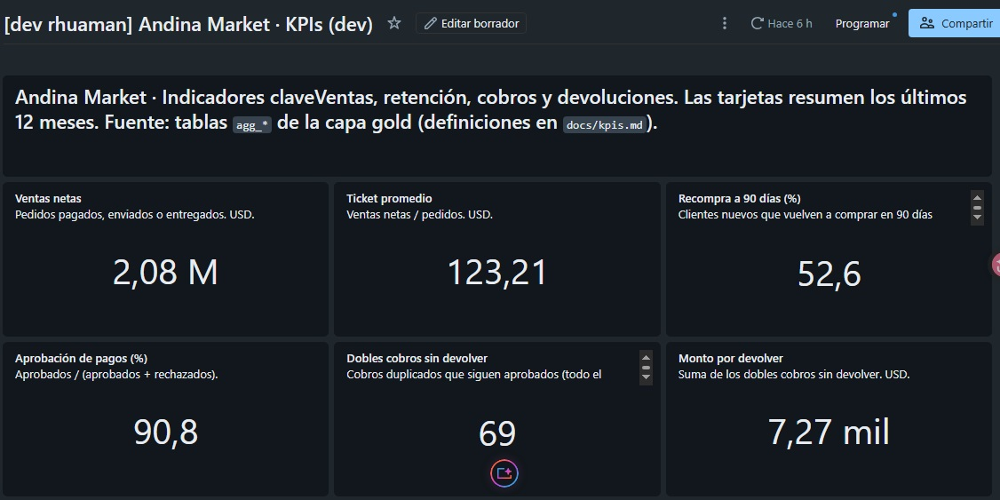

# Andina Market: reto técnico AI Data Engineer

Plataforma de datos de punta a punta sobre Azure y Databricks: la ingesta desde Azure SQL alimenta un lakehouse medallion en Unity Catalog, y de ahí salen la analítica, el feature store, RAG y los agentes.

> **Estado:** en construcción. Niveles 0 a 5 completos: base de origen con datos sintéticos, ingesta incremental hasta bronze, silver con calidad y SCD1/SCD2, modelo estrella en gold, capa de KPIs y dashboard de AI/BI, feature store point-in-time y dos modelos registrados con MLflow, y una capa RAG evaluada con un golden set, todo desplegado con un bundle y orquestado en jobs. Esta sección se actualiza por nivel.

| Nivel | Alcance | Estado |
|---|---|---|
| 0. Fuente | Azure SQL, datos sintéticos, Change Tracking | ✅ |
| 1. Ingesta | JDBC incremental (CT) → landing → Auto Loader → bronze; DABs; diseño streaming y SAP | ✅ |
| 2. Transformación | Lakeflow Declarative Pipelines: silver con expectations, cuarentena, SCD1/SCD2; gold en estrella | ✅ |
| 3. Analítica + BI | Capa de KPIs agregada en gold (4 KPIs) y dashboard de AI/BI | ✅ |
| 4. Feature Store | Features point-in-time en UC, modelos de recompra y tickets urgentes con MLflow, puntuación batch | ✅ |
| 5. RAG | Documentos en un Volume, chunking por sección, Vector Search (Delta Sync), golden set con recall@k | ✅ |
| 6. Agente | Diseño o agente mínimo | ⏳ |

## Estructura

```
source_db/          DDL de Azure SQL (esquema, FK legacy, Change Tracking)
data_generator/     Generador de histórico, simulador de cambios, clickstream
sample_data/        Muestra de eventos de clickstream (.jsonl)
databricks.yml      Bundle (Declarative Automation Bundle): targets dev y prod
resources/          Definición del job y del pipeline del bundle
src/ingesta/        Notebooks de ingesta: extracción con CT → landing, Auto Loader → bronze
src/transform/      Pipeline declarativo: silver (calidad, SCD1/SCD2), gold (modelo estrella) y capa de KPIs
src/validacion/     Validación de punta a punta, última tarea del job
src/dashboards/     Dashboard de AI/BI (.lvdash.json), desplegado por el bundle
src/ml/             Feature store, entrenamiento con MLflow y puntuación batch (nivel 4)
src/rag/            Ingesta e indexación de documentos, evaluación del retrieval (nivel 5)
rag_docs/           Documentos de Andina Market para el RAG (políticas, FAQs, manuales)
docs/               Decisiones de arquitectura y documentación de datos
```

- [Arquitectura: diagramas, infraestructura, permisos y costos](docs/arquitectura.md)
- [Modelo de datos: etapas, silver, modelo estrella y cambios en el tiempo](docs/modelo_datos.md)
- [Reglas de limpieza, transformación y cuarentena](docs/reglas_calidad.md)
- [KPIs y dashboard: definiciones, capa analítica y valores](docs/kpis.md)
- [Feature store y modelos: guía para un ML engineer](docs/feature_store.md)
- [Capa RAG: documentos, chunking, índice, evaluación y ejemplos](docs/rag.md)
- [Registro de decisiones](docs/decisiones.md)
- [Datos sintéticos y casos borde](docs/datos_sinteticos.md)
- [Diseño: clickstream en tiempo real (Event Hubs + Structured Streaming)](docs/diseno_streaming.md)
- [Diseño: integración de SAP ECC on-premise (ADF + SHIR + SAP CDC)](docs/diseno_sap.md)

## Cómo reproducir: base de origen

### 1. Azure SQL Database

1. Crea un servidor lógico y la base `andina_oltp` con la **oferta gratuita** (serverless, General Purpose), idealmente en la misma región del workspace. Activa la auto-pausa. En este reto el servidor es `sql-andina-cus`, en Central US, porque East US 2 no aceptaba servidores nuevos (ver [D-06](docs/decisiones.md)).
2. En **Redes** del servidor:
   - agrega la IP de tu PC;
   - activa *Permitir que los servicios y recursos de Azure accedan a este servidor*. Es necesario porque el cómputo serverless de Databricks no tiene IP fija. En producción se reemplaza por Private Endpoint.

### 2. Tu PC (Windows)

1. Instala Python 3.11 o superior y el [Microsoft ODBC Driver 18 for SQL Server](https://learn.microsoft.com/es-es/sql/connect/odbc/download-odbc-driver-for-sql-server).
2. En PowerShell:

```powershell
python -m venv .venv
.venv\Scripts\Activate.ps1
pip install -r requirements.txt
copy .env.example .env      # y completa servidor, usuario y clave
```

### 3. Generar y cargar

```powershell
# Revisión sin tocar la base: escribe CSV en ./out y muestra la volumetría y los casos borde
python -m data_generator.load_initial --dry-run

# Carga real: crea el esquema, inserta el histórico, agrega la FK legacy y activa Change Tracking
python -m data_generator.load_initial --reset
```

Si la base está en auto-pausa, el primer intento puede fallar con el error 40613. El script reintenta solo.

### 4. Verificar en el Query editor del portal

```sql
SELECT 'Customers' t, COUNT(*) n FROM dbo.Customers UNION ALL
SELECT 'Orders', COUNT(*) FROM dbo.Orders UNION ALL
SELECT 'Payments', COUNT(*) FROM dbo.Payments;
SELECT OBJECT_NAME(object_id) tabla FROM sys.change_tracking_tables;
SELECT CHANGE_TRACKING_CURRENT_VERSION() version_actual;
```

### 5. Simular operación, después de la primera ingesta

```powershell
python -m data_generator.simulate_changes                  # un día de cambios
python -m data_generator.simulate_changes --schema-change  # + columna nueva en Orders
```

## Cómo reproducir: ingesta (nivel 1)

Diagramas completos en [docs/arquitectura.md](docs/arquitectura.md). Resumen:

```
Azure SQL (andina_oltp)                     Unity Catalog: <catalog> = andina_dev | andina_prod
 dbo.* + Change Tracking
        │  01_extract_sqlserver_ct (JDBC)
        │  full la 1.ª vez / CHANGETABLE después
        ▼
 /Volumes/<catalog>/landing/sqlserver/<tabla>/to_v<versión>__<modo>__run_<batch_id>/*.parquet
   (escrito en _staging/ y publicado completo; la marca de agua se guarda después)
        │  02_bronze_autoloader (Auto Loader, availableNow, checkpoint)
        ▼
 <catalog>.bronze.<tabla>   Delta append-only + _ct_version, _ct_operation, _batch_id,
                            _extracted_at, _ingested_at, _source, _source_file
 <catalog>.ops.ct_watermarks · <catalog>.ops.ingestion_log   (control y trazabilidad)
```

### 1. Prerrequisitos en Databricks (una vez)

- Catálogos `andina_dev` y `andina_prod` con los esquemas `landing`, `bronze`, `silver`, `gold`, `ml`, `genai` y `ops`, sobre una ubicación externa ADLS Gen2 ([D-07](docs/decisiones.md)).
- En Azure SQL, un usuario de solo lectura `databricks_reader` (`db_datareader` + `VIEW CHANGE TRACKING`, ver el final de `source_db/03_change_tracking.sql`).
- Un Azure Key Vault con los secretos `server`, `database`, `user` y `password` de ese usuario, y un secret scope `andina-kv` respaldado por él ([D-17](docs/decisiones.md)).
- Un service principal por entorno (`sp-andina-dev`, `sp-andina-prod`) con el derecho `workspace-access`, `ALL PRIVILEGES` solo sobre su catálogo, `READ` sobre el scope, y el rol `servicePrincipal.user` para quien despliega. El bundle los usa con `run_as`.
- [Databricks CLI](https://docs.databricks.com/dev-tools/cli/install.html) autenticada contra el workspace (este proyecto usa `auth_type = azure-cli`).

Los Volumes y las tablas de `ops` los crea el propio job si no existen.

### 2. Desplegar y ejecutar

```powershell
databricks bundle validate
databricks bundle deploy -t dev
databricks bundle run andina_ingesta -t dev     # 1.ª vez: carga completa
python -m data_generator.simulate_changes --schema-change
databricks bundle run andina_ingesta -t dev     # incremental + columna nueva
```

El job tiene un schedule horario que queda en pausa en ambos targets: se activa a propósito al promover a producción.

### 3. Verificar

```sql
-- Qué se extrajo en cada lote, en qué modo y si cambió el esquema
SELECT batch_id, source_table, mode, from_version, to_version, rows_extracted, schema_changed, added_columns, status
FROM andina_dev.ops.ingestion_log ORDER BY started_at DESC;

-- Historial de un pedido en bronze: snapshot inicial (S) y sus cambios (I/U/D)
SELECT OrderId, Status, _ct_version, _ct_operation, _batch_id, _ingested_at
FROM andina_dev.bronze.orders WHERE OrderId = 26408 ORDER BY _ct_version;
```

Resultado de la prueba del 29/09/2026: la carga completa dejó en bronze exactamente las 116.925 filas de la fuente, sin duplicados, aun después de una falla y reanudación de la tarea de bronze. El incremental trajo 774 cambios netos (incluidos 6 DELETE de tickets) y la columna nueva `Orders.CouponCode`, detectada en `ingestion_log` y agregada a bronze sin intervención.

## Cómo reproducir: transformación (nivel 2)

El pipeline `andina_transform` (Lakeflow Declarative Pipelines, serverless) se despliega con el mismo bundle y corre como tercera tarea del job `andina_ingesta`. Etapas, diagrama del modelo y manejo de cambios en el tiempo: [docs/modelo_datos.md](docs/modelo_datos.md).

```powershell
databricks bundle deploy -t dev
databricks bundle run andina_ingesta -t dev      # extracción → bronze → silver → gold
databricks bundle run andina_transform -t dev    # solo silver y gold
```

### Verificar

```sql
-- Problemas de calidad por regla y acción (nada se descarta en silencio)
SELECT rule, action, count(*) FROM andina_dev.silver.data_quality_issues GROUP BY ALL ORDER BY 1;

-- Historial SCD2 del segmento de un cliente
SELECT customer_id, segment, __START_AT.updated_at AS desde, __END_AT.updated_at AS hasta
FROM andina_dev.silver.customer_segment_history WHERE customer_id = 5115 ORDER BY __START_AT._ct_version;

-- Las ventas de gold cuadran con silver (incluye las líneas con producto desconocido)
SELECT (SELECT sum(line_amount) FROM andina_dev.gold.fact_order_lines) AS gold,
       (SELECT sum(line_amount) FROM andina_dev.silver.order_items)    AS silver;
```

Las métricas de cada expectation se ven en la interfaz del pipeline (pestaña **Data quality** de cada tabla).

Resultado de las pruebas del 30/09/2026:
- **Casos borde:** los del catálogo se detectan todos, con su causa: 57 cuentas duplicadas, 70 dobles cobros, 25 líneas en cuarentena, 50 líneas con cantidad 0, 3 fechas futuras corregidas y 140 descuentos en cabecera, además de los que explica una línea en 0.
- **Consistencia:** las ventas de gold cuadran al centavo con silver.
- **Incremental:** un día simulado pasó por el job completo y abrió nuevas versiones SCD2 de segmentos y pagos.
- **Idempotencia:** volver a ejecutar el pipeline sin datos nuevos deja todas las tablas idénticas, incluidas las claves sustitutas.
- **Promoción a producción:** el mismo bundle se desplegó con `-t prod` (catálogo `andina_prod`, identidad `sp-andina-prod`) y el job completo pasó todas las validaciones en la primera corrida, sin cambiar código.

Después de la revisión de seguridad y robustez (D-14, D-17), el entorno dev se reconstruyó desde cero como `sp-andina-dev` y reprodujo los mismos totales. Además se probaron en vivo los escenarios corregidos:
- **Línea que pasa a cantidad 0:** sale de silver y las ventas bajan exactamente su importe (38,70 USD).
- **Doble cobro reembolsado:** sigue detectado, con su estado actual "Reembolsado".
- **Borrado durante una recarga completa:** genera el DELETE sintético y el ticket desaparece de silver.
- **Job completo sin cambios en la fuente:** todas las tablas quedan idénticas, y las 21 validaciones de `ops.validation_log` pasan en cada corrida.

## Cómo reproducir: KPIs y dashboard (nivel 3)

La capa analítica (`gold.agg_*`) se calcula en el mismo pipeline que gold, y el dashboard se despliega con el bundle. Definiciones y valores: [docs/kpis.md](docs/kpis.md).

```powershell
databricks bundle deploy -t dev          # incluye el dashboard
databricks bundle summary -t dev         # muestra la URL del dashboard
```

| KPI | Tabla |
|---|---|
| Ventas netas y ticket promedio (por mes, país, canal y segmento) | `gold.agg_sales_monthly` |
| Recompra a 90 días por cohorte | `gold.agg_repurchase_cohorts` |
| Aprobación de pagos y dobles cobros sin devolver | `gold.agg_payments_monthly` |
| Tasa de devolución por categoría | `gold.agg_returns_monthly` |

La validación del job comprueba en cada corrida que los agregados cuadren con los hechos.



Más capturas en [docs/kpis.md](docs/kpis.md).

## Cómo reproducir: feature store y modelos (nivel 4)

Job `andina_ml` (serverless): tablas de features → entrenamiento de los dos modelos → puntuación batch. Guía completa para un ML engineer: [docs/feature_store.md](docs/feature_store.md).

```powershell
databricks workspace mkdirs /Shared/andina_market     # carpeta de los experimentos de MLflow (una vez)
databricks bundle deploy -t dev
databricks bundle run andina_ml -t dev
```

| Pieza | Dónde |
|---|---|
| Features del cliente (foto semanal, clave de tiempo) | `ml.customer_features` |
| Features del ticket | `ml.ticket_features` |
| Modelos (Unity Catalog, alias `champion`) | `ml.repurchase_propensity`, `ml.urgent_ticket_classifier` |
| Puntajes | `ml.repurchase_scores`, `ml.urgent_ticket_scores` |
| Experimentos | `/Shared/andina_market/<catalog>_*` |

Resultados de la evaluación temporal: recompra a 90 días con ROC AUC 0,822 (frente a 0,780 de ordenar por recencia); tickets urgentes con ROC AUC 0,854 y PR AUC 0,66 sobre un 18,7 % de urgentes. Se verificó con SQL independiente que las features de cada foto solo cuentan hechos anteriores a su fecha.

## Cómo reproducir: capa RAG (nivel 5)

Job `andina_rag` (serverless): documentos de `rag_docs/` al Volume `genai.docs` → chunks por sección en `genai.doc_chunks` → índice Delta Sync de Vector Search → evaluación con el golden set. Detalle, métricas y ejemplos: [docs/rag.md](docs/rag.md).

```powershell
databricks bundle deploy -t dev
databricks bundle run andina_rag -t dev
```

Resultado con búsqueda híbrida: recall@5 de 0,933 y MRR de 0,769 sobre 30 preguntas. El endpoint de Vector Search se cobra por hora mientras exista: borrarlo cuando no se use (el job lo recrea).

## Uso de IA

Construido con Claude como asistente, que propuso código y documentación bajo mi dirección y revisión. Detalle por componente:

- **Generador de datos, DDL y documentación inicial:** generados con Claude, y revisados y ajustados por mí.
- **Infraestructura de Azure y Unity Catalog:** Claude ejecutó los comandos de Azure CLI y Databricks CLI bajo mi aprobación paso a paso. Las incidencias (regiones bloqueadas, IP dinámica) y sus decisiones están en D-06 y D-07.
- **Ingesta del nivel 1 (notebooks y bundle):** generados con Claude a partir del diseño del plan del proyecto (Change Tracking, landing en Parquet, bronze append-only). Claude también ejecutó la prueba de punta a punta; los resultados se verifican con las consultas de la sección anterior.
- **Diagramas y diseños de streaming y SAP:** redactados con Claude. Las cifras del clickstream (duplicados, retrasos, anónimos) salen de analizar la muestra real; las decisiones y alternativas deben poder defenderse en la entrevista, así que conviene revisarlas.
- **Transformación del nivel 2 (pipeline, reglas de calidad y modelo):** generados con Claude a partir del catálogo de casos borde. La validación contra los números esperados mostró tres reglas que había que afinar (duplicados, pedidos sin líneas y totales que no cuadran); el ajuste y su motivo están en D-14.
- **Revisión de seguridad y robustez del nivel 2:** pedí a Claude una revisión crítica de lo construido. Encontró 10 debilidades (credenciales con privilegios de administrador, datos personales en gold, ejecución con usuario personal, una regla `drop` que podía inflar ventas, borrados perdidos en una recarga completa, entre otras). Decidí corregirlas, usar service principals también en dev y guardar las credenciales en Key Vault (D-14, D-17).
- **KPIs y dashboard del nivel 3:** las definiciones, la capa agregada y el JSON del dashboard se generaron con Claude. Cada consulta del dashboard se ejecutó contra los datos para verificarla, y los valores se contrastaron con los parámetros del generador (ticket promedio, mezcla de canales, tasa de rechazo con tarjeta). Al revisar las capturas detecté que las primeras cohortes de recompra salían infladas por censura por la izquierda (clientes registrados antes del historial); se corrigió la definición (D-18).
- **Feature store y modelos del nivel 4:** el diseño (fotos semanales point-in-time, exclusión del segmento por fuga del futuro, validación temporal, línea base) y el código se generaron con Claude. Las métricas son las de la corrida real; el point-in-time se verificó con una consulta independiente.
- **Capa RAG del nivel 5:** los 11 documentos de Andina Market se generaron con Claude a partir de los datos de la base (mismos métodos de pago, reglas de segmento, tipos de ticket y catálogo), como pide el reto. El pipeline, el golden set y la evaluación también. Las métricas son las reales; la evaluación guió dos mejoras (tablas linealizadas, vocabulario del cliente) y mostró una respuesta con un error que se documenta en lugar de esconderse.
- *(Se completa por nivel.)*
