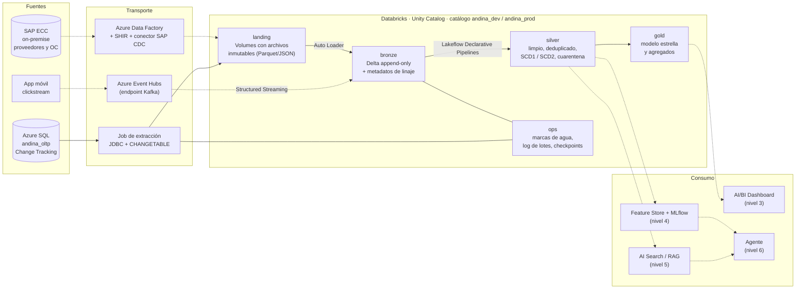
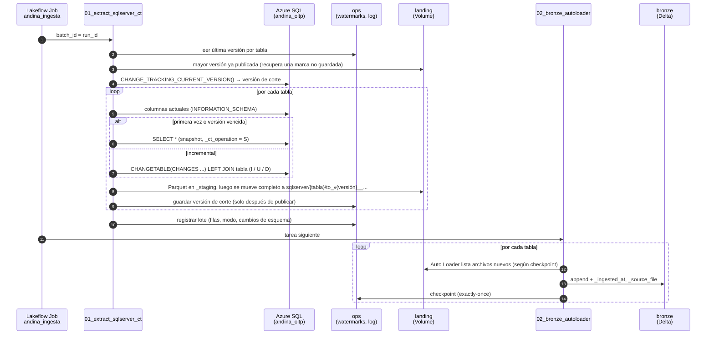
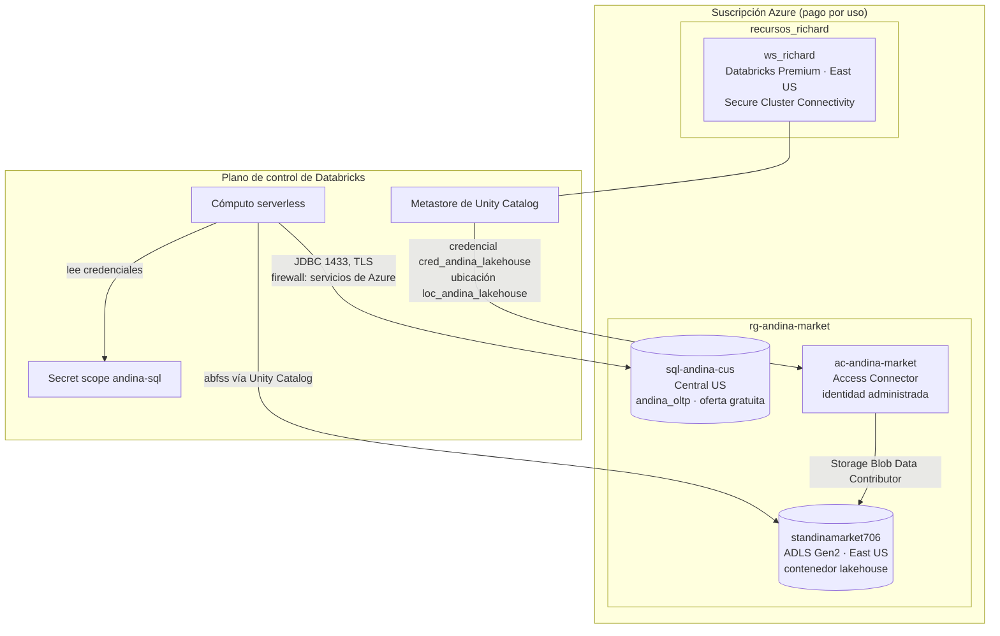

# Arquitectura de datos de Andina Market

Este documento es el diagrama propio que pide el reto para el nivel 1, con las decisiones de infraestructura (workspace, almacenamiento, permisos y costos) y por qué esta arquitectura se ajusta a Andina Market. El detalle de cada decisión está en el [registro de decisiones](decisiones.md); los diseños de las fuentes no implementadas están en [streaming](diseno_streaming.md) y [SAP](diseno_sap.md).

Los diagramas están en Mermaid: GitHub los muestra como imagen y se versionan junto con el código.

## 1. Vista general

Las líneas continuas están implementadas; las punteadas son diseño (nivel 1, extensión) o niveles posteriores.

**Por qué medallion para Andina Market:**

- **bronze** conserva todo lo que llegó, tal cual, con su linaje. Andina Market tiene fuentes muy distintas (OLTP, eventos, ERP), y una capa común de datos crudos permite reprocesar cuando cambia una regla sin volver a tocar las fuentes. También guarda el historial de cambios que el OLTP no guarda, como cada estado de un pago.
- **silver** es donde se resuelven los problemas reales de la fuente: clientes duplicados, países sucios, huérfanos, dobles cobros ([datos sintéticos](datos_sinteticos.md)). Es la capa que consumen ML y RAG, porque necesitan entidades limpias, no agregados.
- **gold** responde preguntas del negocio (ventas, conversión, recompra) con un modelo estable para BI.
- **landing** antecede a bronze solo para las fuentes por lotes: desacopla la extracción de la carga y deja una copia auditable (D-08). El streaming entra directo a bronze porque Event Hubs ya retiene los eventos y cumple ese papel.

## 2. Flujo de la ingesta implementada

Una corrida del job `andina_ingesta` (Lakeflow Job, dos tareas serverless):

Garantías: cada rango de versiones se publica una sola vez en landing y cada archivo se carga una sola vez en bronze, aun con reintentos y caídas entre pasos; se probó forzando una falla (D-09). Una columna nueva en la fuente se detecta, se registra y se agrega a bronze sin intervención (D-10).

## 3. Infraestructura

| Componente | Decisión | Por qué |
|---|---|---|
| Workspace | Azure Databricks Premium, East US, Secure Cluster Connectivity | Unity Catalog y serverless requieren Premium. Sin IP pública en los nodos (D-01, D-02) |
| Cómputo | Serverless para jobs, notebooks y SQL warehouse | No consume la cuota de vCPU de la suscripción y no hay clusters que administrar (D-01) |
| Almacenamiento | ADLS Gen2 propio, un catálogo por entorno con su propia raíz | Independiente del ciclo de vida del workspace; dev y prod aislados (D-07) |
| Acceso al almacenamiento | Access Connector con identidad administrada | Sin secretos que rotar; rol limitado a una cuenta de almacenamiento |
| Credenciales de la fuente | Secret scope de Databricks | Fuera del código y ocultas en la salida. En producción: scope respaldado por Key Vault |
| Fuente | Azure SQL serverless en Central US | East US y East US 2 no aceptaban servidores nuevos; el tráfico entre regiones es despreciable a este volumen (D-06) |
| Despliegue | Declarative Automation Bundle, targets dev y prod | El mismo código se promueve cambiando solo el catálogo (D-11) |

### Permisos (modelo propuesto)

Hoy todo corre con el usuario del candidato, que es dueño de los catálogos. En producción el modelo sería:

| Principal | andina_dev | andina_prod |
|---|---|---|
| Service principal `sp-andina-jobs` (ejecuta los jobs de prod, `run_as` del bundle) | — | `USE CATALOG`; `MODIFY` y `SELECT` en landing, bronze, silver, gold y ops |
| Grupo `data-engineers` | `ALL PRIVILEGES` | `SELECT` en todo; sin escritura directa: se despliega solo por bundle |
| Grupo `analistas` | — | `SELECT` en gold |
| Grupo `data-science` | `SELECT` en silver; `ALL PRIVILEGES` en ml | `SELECT` en silver y gold; `MODIFY` en ml |
| Aplicaciones GenAI | — | `SELECT` en genai y funciones de UC específicas |

Principios: nadie escribe en prod a mano; bronze y ops solo los escribe el pipeline; los datos personales de clientes se exponen a analistas solo en gold, agregados o enmascarados.

### Costos

| Recurso | Costo en el reto |
|---|---|
| Azure SQL con oferta gratuita | 0: se pausa sola al agotar el límite mensual |
| ADLS Gen2 LRS | Céntimos al mes |
| Workspace, Unity Catalog, Access Connector, secret scope | 0 fijo |
| Job de ingesta serverless | Solo DBU mientras corre (minutos por corrida). El schedule horario queda en pausa hasta pasar a producción |

Palancas de costo en producción: frecuencia del job (la mayor), `availableNow` en lugar de streams continuos donde la latencia lo permita, y auto-pausa de la fuente.
