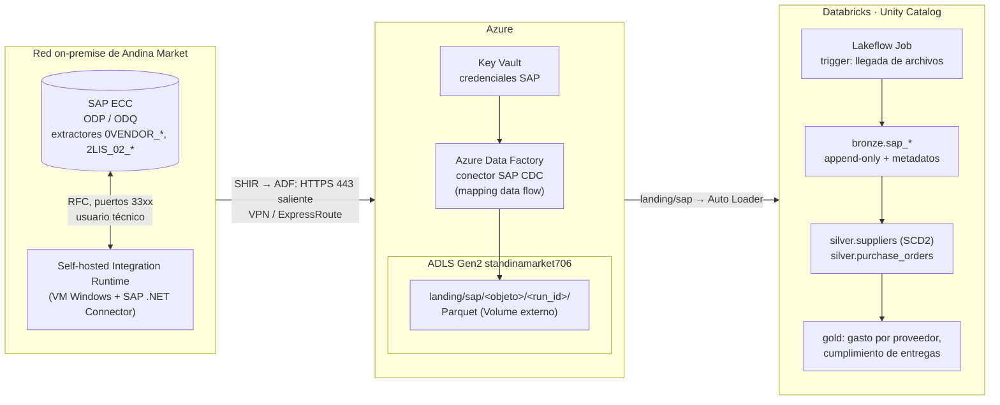

# Diseño: integración de SAP ECC on-premise

Extensión de diseño del nivel 1 (sin implementación). Andina Market tiene el maestro de proveedores y las órdenes de compra en un SAP ECC on-premise; la propuesta los integra a la misma arquitectura de landing → bronze → silver → gold que ya funciona para Azure SQL.

## 1. Qué se necesita traer

| Objeto de negocio | Tablas de ECC | Extractor ODP con delta | Volumen y cambio |
|---|---|---|---|
| Proveedores | `LFA1` (general), `LFB1` (por sociedad), `LFM1` (por organización de compras) | `0VENDOR_ATTR`, `0VENDOR_TEXT` | Pocos miles de filas; cambia poco |
| Órdenes de compra, cabecera | `EKKO` | `2LIS_02_HDR` | Crece a diario; cambia de estado |
| Órdenes de compra, posiciones | `EKPO` | `2LIS_02_ITM` | Varias por orden |
| Repartos (fechas de entrega) | `EKET` | `2LIS_02_SCL` | Para medir cumplimiento del proveedor |

**Minimización de datos:** no se extraen los datos bancarios de proveedores (`LFBK`) ni campos personales que la analítica no usa. Lo que no entra al lakehouse no hay que protegerlo.

## 2. Arquitectura propuesta

### Por qué Azure Data Factory con el conector SAP CDC

- **Delta nativo de SAP:** el conector usa el framework ODP de SAP. SAP mantiene la cola de cambios (ODQ) por suscriptor, así que cada corrida trae solo lo nuevo o modificado, con el tipo de cambio (`ODQ_CHANGEMODE`: alta, modificación, borrado). Es el equivalente de Change Tracking del lado SAP.
- **Llega a una red privada:** el Self-hosted Integration Runtime se instala dentro de la red on-premise y solo abre conexiones salientes por HTTPS hacia Azure. No hay que exponer SAP a internet ni abrir puertos entrantes.
- **Encaja en lo que ya existe:** ADF deja Parquet en `landing`, y desde ahí es el mismo camino que Azure SQL: Auto Loader, bronze append-only con metadatos de linaje, silver y gold.
- **Servicio gestionado** del mismo ecosistema Azure, con monitoreo, reintentos y credenciales en Key Vault.

### Alternativas evaluadas

| Alternativa | Por qué no es la primera opción |
|---|---|
| **Conector SAP Table de ADF** (lectura directa de tablas por RFC) | No tiene delta: habría que leer tablas completas o filtrar por fecha de modificación, que en ECC no siempre existe o no es confiable |
| **SAP SLT** (replicación por triggers en la base de SAP) | Latencia casi real y soportado por SAP, pero requiere licencia y un servidor SLT, y agrega triggers en la base del ERP. Se justifica si el negocio necesita las OC en minutos |
| **SAP Datasphere o SAP Business Data Cloud** | Camino oficial de SAP hacia Databricks (Delta Sharing), pero está orientado a S/4HANA y a clientes en la nube de SAP. Para un ECC on-premise implica un proyecto de migración mayor |
| **Herramientas de terceros** (Fivetran, Qlik Replicate) | Funcionan bien, pero agregan otro proveedor y otra factura. Válidas si la empresa ya las tiene |
| **Exportaciones de archivos desde SAP** | Simple, pero sin delta confiable ni trazabilidad, y depende de jobs manuales en SAP |

**Riesgo de licenciamiento a validar con SAP:** la nota SAP 3255746 restringe el uso de las APIs RFC de ODP por aplicaciones de terceros. Antes de producción, Andina Market debe confirmar con SAP que su contrato cubre este uso. Si no lo cubre, la opción conforme es SLT o Datasphere, y el resto de la arquitectura (landing → bronze → silver) no cambia.

## 3. Decisiones de detalle

| Tema | Decisión |
|---|---|
| **Escritura en landing** | ADF escribe en un **Volume externo** `andina_<env>.landing.sap` sobre una carpeta del mismo ADLS. La identidad administrada de ADF solo tiene permiso de escritura en esa carpeta. ADF no puede escribir en el almacenamiento gestionado de Unity Catalog, por eso el Volume es externo |
| **Formato** | Parquet, un directorio por objeto y corrida: `sap/<objeto>/<run_id>/`. Mismo patrón que Azure SQL |
| **Orquestación** | ADF corre en su schedule; el job de Databricks usa un **trigger por llegada de archivos** sobre `landing/sap`. Los dos sistemas quedan desacoplados: ninguno tiene que conocer el estado del otro |
| **Frecuencia** | Proveedores: diaria. Órdenes de compra: cada hora en horario laboral. El delta de ODQ evita releer el histórico |
| **Carga inicial** | Primera corrida de ADF en modo "full + delta init": trae el histórico y abre la suscripción de delta en SAP. En los extractores `2LIS_02_*` requiere llenar antes las tablas de setup en SAP (tarea del equipo SAP) |
| **Bronze** | `bronze.sap_vendor_attr`, `bronze.sap_po_header`, `bronze.sap_po_item`, `bronze.sap_po_schedule`: append-only, con `ODQ_CHANGEMODE` y el contador de ODQ como equivalentes de `_ct_operation` y `_ct_version`, más `_source = sap:<SID>.<cliente>.<extractor>` |
| **Silver** | Nombres de negocio en lugar de los técnicos (`LIFNR` → `supplier_id`, `EBELN` → `po_number`), fechas y montos tipados, conversión de moneda (`WAERS`) a USD con tabla de tipos de cambio (supuesto D-05), proveedores como SCD2 (cambios de condiciones de pago o de dirección) |
| **Integración con el resto del modelo** | Una tabla de correspondencia `silver.product_material_map` entre el material de SAP (`MATNR`) y el `SKU` del catálogo de Andina Market. Permite unir compras a proveedores con ventas por producto (margen, quiebres de stock). Los materiales sin correspondencia van a cuarentena, no se descartan |
| **Seguridad** | Usuario técnico de SAP solo con autorizaciones RFC y de lectura de ODP (`S_RFC`, `S_RO_OSOA`). Credenciales en Key Vault, nunca en ADF. Conexión VPN o ExpressRoute entre la red on-premise y Azure |
| **Monitoreo** | Alertas de ADF ante fallas; en SAP, revisar la cola ODQ (`ODQMON`) para que no crezca sin consumirse |

## 4. Qué se reutiliza de lo ya construido

- El mismo catálogo por entorno y la misma organización `landing → bronze → silver → gold` (D-07).
- El notebook de Auto Loader a bronze: basta agregar las carpetas de SAP a su configuración; el checkpoint, la evolución de esquema y los metadatos funcionan igual.
- El mismo bundle: un job nuevo para SAP con su trigger por llegada de archivos, desplegado a dev y prod igual que `andina_ingesta`.
- Lo que cambia es solo el transporte (ADF + SHIR en lugar de JDBC) y el mecanismo de delta (ODQ en lugar de Change Tracking).
