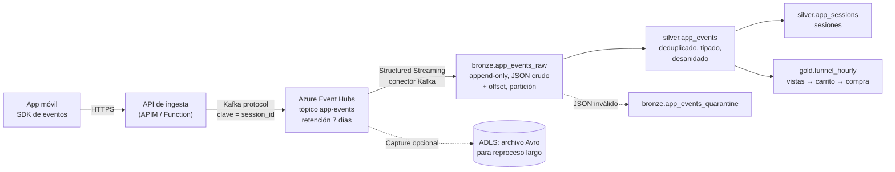

# Diseño: ingesta del clickstream en tiempo real

Extensión de diseño del nivel 1 (sin implementación). Cómo se ingeriría en tiempo real el flujo que hoy representa `sample_data/clickstream_app_events.jsonl`.

## 1. Qué trae el flujo

Análisis de la muestra (6.559 eventos de un día):

| Característica | En la muestra | Qué exige al diseño |
|---|---|---|
| Tipos de evento | `session_start` 926, `product_view` 4.166, `add_to_cart` 1.016, `remove_from_cart` 89, `checkout_start` 239, `purchase` 123 | Un solo tópico con campos opcionales según el tipo |
| Duplicados | 141 eventos (~2 %) con un `event_id` repetido: el SDK reenvía si no recibe confirmación | Deduplicar por `event_id` |
| Eventos tardíos | El 99 % llega en segundos; ~2,5 % llega entre 1 y 6 horas tarde (app sin conexión). Máximo observado: 6 h | Distinguir `event_ts` (cuándo pasó) de `sent_ts` (cuándo se envió); tolerar hasta 6 h de retraso |
| Anónimos | 1.604 eventos con `customer_id` nulo | No descartarlos: cuentan para el funnel y se pueden asociar al cliente por `session_id` si luego inicia sesión |
| Deriva de esquema | La app 5.x agrega `campaign` | El esquema debe aceptar campos nuevos sin detener el flujo |
| Anidados | `device` (os, app_version) e `items` (líneas en `purchase`) | Guardar el JSON crudo y desanidar en silver |

## 2. Arquitectura propuesta



### Transporte: Azure Event Hubs con endpoint Kafka

- **Por qué Event Hubs:** es el servicio gestionado de Azure para ingesta de eventos, habla protocolo Kafka (el SDK o la API pueden usar clientes Kafka estándar) y retiene los eventos varios días, así que cumple el papel de "landing" del streaming: si el consumidor falla, se reprocesa desde Event Hubs.
- **Descartado: Kafka propio (HDInsight, Confluent en VMs).** Más control, pero hay que operar brokers. Confluent Cloud sería válido si la empresa ya lo usa.
- **Clave de partición = `session_id`:** los eventos de una sesión caen en la misma partición y conservan su orden relativo.
- **La app no escribe directo en Event Hubs:** pasa por una API que autentica al dispositivo, valida el tamaño y agrega `received_ts`. Así no se reparten credenciales de Event Hubs dentro de la app.
- **Capacidad:** el volumen de la muestra (miles de eventos por día) cabe holgadamente en el tier Standard con 1 unidad de throughput. En campañas se escala con auto-inflate.

### Consumo: Structured Streaming en Lakeflow Declarative Pipelines

Se implementaría como un pipeline declarativo (el mismo motor que silver en el nivel 2) con tablas de streaming:

```python
# bronze: lo que llega, sin interpretar
@dlt.table(name="app_events_raw", table_properties={"delta.appendOnly": "true"})
def app_events_raw():
    return (spark.readStream.format("kafka")
            .options(**eventhubs_kafka_options)          # SASL/OAuth desde un secret scope
            .option("subscribe", "app-events")
            .option("startingOffsets", "earliest")
            .load()
            .select(F.col("value").cast("string").alias("payload"),
                    "topic", "partition", "offset", F.col("timestamp").alias("enqueued_ts"),
                    F.current_timestamp().alias("_ingested_at")))

# silver: tipado, deduplicado y con tolerancia a tardíos
@dlt.table(name="app_events")
@dlt.expect_or_drop("event_id_presente", "event_id IS NOT NULL")
@dlt.expect("tipo_conocido", "event_type IN ('session_start','product_view','add_to_cart','remove_from_cart','checkout_start','purchase')")
def app_events():
    return (dlt.read_stream("app_events_raw")
            .select("*", F.from_json("payload", EVENT_SCHEMA, {"mode": "PERMISSIVE"}).alias("e"))
            .select("e.*", "partition", "offset", "_ingested_at")
            .withColumn("event_ts", F.to_timestamp("event_ts"))
            .withWatermark("event_ts", "6 hours")
            .dropDuplicatesWithinWatermark(["event_id"]))
```

## 3. Decisiones clave

| Tema | Decisión | Por qué |
|---|---|---|
| **Trigger** | Bronze: continuo con `processingTime = '1 minute'`. Silver y gold: el mismo pipeline en modo continuo si el negocio necesita el funnel al minuto; si no, `availableNow` cada 15 minutos | El costo de un stream continuo es un cluster siempre encendido. El caso de uso (funnel, recomendaciones del día) tolera minutos. El código no cambia entre un modo y otro |
| **Watermark** | `event_ts` con 6 horas | Es el retraso máximo observado. Más corto descarta compras tardías del funnel; más largo aumenta el estado en memoria. Se revisa con la métrica de eventos descartados por tardíos |
| **Deduplicación** | `dropDuplicatesWithinWatermark(event_id)` | Los reenvíos del SDK llegan segundos después del original, muy dentro del watermark. El estado se limpia solo al avanzar el watermark |
| **Checkpoints** | Uno por tabla de streaming, gestionado por el pipeline (en un Volume si fuera un job de Structured Streaming) | Guarda los offsets de Kafka y el estado de deduplicación. Con el checkpoint y la escritura transaccional de Delta, cada evento se escribe una vez aunque el stream se reinicie (exactly-once de punta a punta) |
| **Tiempo de evento vs. de proceso** | Las métricas se calculan por `event_ts`; `sent_ts` y `enqueued_ts` se guardan para medir el retraso | Un evento de las 10:00 que llega a las 14:00 pertenece a las 10:00 |
| **Tardíos más allá de 6 h** | Bronze los guarda siempre (no hay watermark en bronze). Un job diario recalcula gold del día anterior desde silver | No se pierde nada: el watermark solo limita el estado del stream, no los datos crudos |
| **Evolución de esquema** | Bronze guarda el JSON crudo (`payload`), que nunca rompe. Silver parsea con un esquema explícito y versionado; los campos nuevos (`campaign`) se agregan al esquema con un cambio de código. Los campos desconocidos quedan en el crudo | Parsear con esquema explícito evita que un campo con tipo equivocado cambie la tabla sin aviso |
| **JSON inválido** | Cuarentena (`app_events_quarantine`) con el payload y el error | Nunca se descarta en silencio |
| **Anónimos** | Se conservan; `customer_id` se completa en `silver.app_sessions` si la sesión luego se autentica | Son el 24 % de los eventos: sacarlos distorsiona la conversión |
| **Unión con el OLTP** | `purchase.order_ref` se une con `Orders` en silver/gold | Permite medir la conversión de app contra pedidos reales |

## 4. Cómo migraría la ingesta actual (Azure SQL) a streaming

La tarea de bronze ya es Structured Streaming (Auto Loader con checkpoint); hoy corre con `trigger(availableNow=True)`, que procesa lo pendiente y termina. Para acercarla a tiempo real:

1. **Bronze:** cambiar el trigger a `processingTime` y ejecutarlo como tarea continua. No cambian ni el checkpoint ni las tablas.
2. **Extracción:** Change Tracking se consulta; no empuja cambios. Bajar la frecuencia del job a pocos minutos funciona, pero cada corrida consulta la fuente. Para latencia real de segundos, se reemplazaría por un CDC con log de transacciones que publique en Event Hubs (Debezium sobre CDC de SQL Server, o Lakeflow Connect), y bronze leería de Event Hubs como el clickstream.

Evaluación honesta: para pedidos y pagos, una latencia de minutos a una hora es suficiente para analítica y ML. El streaming se justifica para el clickstream, donde el valor está en reaccionar durante la sesión.
