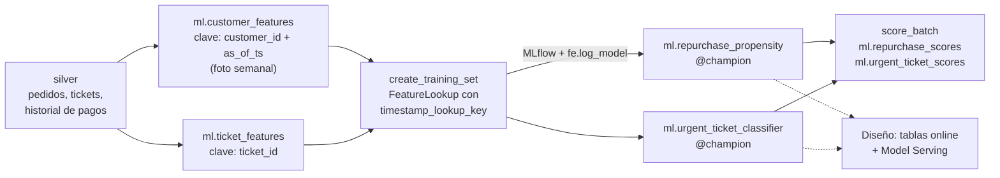

# Feature store y modelos (nivel 4)

Guía para un ML engineer de Andina Market: qué features hay, cómo pedirlas, qué garantías tienen y cómo se entrenan, registran y sirven los modelos. Las decisiones con sus alternativas están en D-19 a D-21.

## 1. Arquitectura



Todo corre en el job `andina_ml` (serverless, con el service principal del entorno): **features → entrenar los dos modelos en paralelo → puntuar → validar**. Código en `src/ml/`.

## 2. Catálogo de features

### `ml.customer_features`: foto semanal del cliente

Clave primaria `customer_id` + `as_of_ts` (**clave de tiempo**). Una fila por cliente y por lunes, desde su alta.

| Feature | Definición | Para qué sirve |
|---|---|---|
| `tenure_days` | Días desde el alta | Antigüedad |
| `days_since_last_order` | Días desde la última compra efectiva (nulo si nunca compró) | Recencia: el predictor más fuerte de recompra |
| `orders_90d`, `orders_365d`, `orders_lifetime` | Compras efectivas en 90 días, 365 días y desde el alta | Frecuencia |
| `net_sales_365d` | Ventas netas del último año (USD) | Valor del cliente |
| `avg_order_value_365d` | Ticket promedio del último año | Tipo de comprador |
| `app_share_365d` | Proporción de compras por la app en el último año | Canal preferido |
| `favorite_category_365d` | Categoría con más unidades en el último año | Afinidad de producto |
| `tickets_90d`, `urgent_tickets_90d` | Tickets de soporte (y urgentes) en 90 días | Fricción con el servicio |
| `rejected_payments_90d` | Pagos rechazados en 90 días (según el historial de estados) | Fricción en el cobro |

"Compra efectiva" = pedido Pagado, Enviado o Entregado, igual que en los KPIs del nivel 3.

**Las features son de la persona, no de la cuenta.** Si alguien tiene dos cuentas (las 57 cuentas duplicadas que detecta silver), sus pedidos, tickets y pagos se suman, y `tenure_days` cuenta desde su primer registro. La clave sigue siendo `customer_id`: cualquiera de sus cuentas devuelve las mismas features, así que quien consume no tiene que saber nada de duplicados. La validación del job lo comprueba (`ml.cuentas_de_una_persona_con_features_distintas = 0`).

### `ml.ticket_features`: el ticket al momento de crearse

Clave primaria `ticket_id`. Campos: `subject`, `body`, `channel`, `body_length`, `has_order`, `created_hour` (y `customer_id`, `created_at` para cruzar con las features del cliente).

## 3. Garantías

| Garantía | Cómo se cumple |
|---|---|
| **Sin fuga del futuro (point-in-time)** | La foto de `as_of_ts` se calcula solo con hechos **anteriores** a esa fecha. Al entrenar, `timestamp_lookup_key` trae la foto más reciente que **no supera** la fecha de la observación |
| **Mismas features al entrenar y al puntuar** | El modelo se guarda con `fe.log_model`: queda registrado qué features usa y de qué tabla. `score_batch` las busca solo con la misma lógica; el consumidor no recalcula nada |
| **Reproducibilidad** | Las tablas de features son Delta (con historial de versiones) y cada entrenamiento queda en MLflow con parámetros, métricas, la versión del modelo y el linaje hacia las tablas de features y de silver en Unity Catalog |
| **Frescura** | El job `andina_ml` recalcula las features a diario. Una foto semanal significa que, entre lunes, la foto vigente tiene hasta 6 días; es la contrapartida de no recalcular todo cada día |
| **Idempotencia** | Las features se recalculan completas y se escriben con `merge` por clave primaria: repetir la corrida no cambia nada |

**Límite conocido: `orders_lifetime` cuenta desde el inicio del historial** (octubre de 2024), no desde el alta. Para los 1.846 clientes registrados antes, subestima su historia real; `tenure_days` sí es exacta. Es la misma censura por la izquierda corregida en el KPI de recompra (D-18); para el modelo es aceptable porque las features de 90 y 365 días pesan más.

**Una feature que se excluyó a propósito: el segmento del CRM.** Su historial existe solo desde la primera ingesta (D-05). Para observaciones anteriores habría que usar el segmento de hoy, que el CRM calcula con compras posteriores: eso es fuga del futuro y el modelo parecería mejor de lo que es.

## 4. Cómo pedir features (entrenamiento)

```python
from databricks.feature_engineering import FeatureEngineeringClient, FeatureLookup

fe = FeatureEngineeringClient()
# labels: un DataFrame con customer_id, la fecha de cada observación (obs_ts) y la etiqueta
training_set = fe.create_training_set(
    df=labels,
    feature_lookups=[FeatureLookup(
        table_name="andina_dev.ml.customer_features",
        lookup_key="customer_id",
        timestamp_lookup_key="obs_ts",          # trae la foto vigente en esa fecha, no la de hoy
        feature_names=["days_since_last_order", "orders_90d", "net_sales_365d"],
    )],
    label="label",
)
df = training_set.load_df()
```

Lo que el ML engineer **necesita saber**: la clave del cliente (`customer_id`), la fecha de cada observación y las features que quiere. **No necesita** saber cómo se calcula cada feature ni de qué tablas de silver sale.

## 5. Cómo puntuar (batch)

```python
scores = fe.score_batch(
    model_uri="models:/andina_dev.ml.repurchase_propensity@champion",
    df=customers,            # solo customer_id y la fecha a la que se puntúa
)
```

El job deja los resultados en `ml.repurchase_scores` (probabilidad de recompra de cada cliente con compras) y `ml.urgent_ticket_scores` (probabilidad de urgencia de cada ticket abierto o en proceso).

## 6. Baja latencia (diseño, no desplegado)

Para usar la propensión en la web o en la app (por ejemplo, mostrar un cupón a quien probablemente no vuelva), o para priorizar un ticket en el momento en que entra:

1. **Publicar las features en una tabla online** de Databricks (respaldada por Lakebase), sincronizada desde `ml.customer_features`. Responde por clave en milisegundos.
2. **Servir el modelo `@champion` en Model Serving.** Como se registró con `fe.log_model`, el endpoint busca las features en la tabla online solo: la aplicación envía `customer_id` y recibe la probabilidad.
3. **Features en tiempo real:** las de un ticket nuevo (asunto, cuerpo) llegan en la misma solicitud; las del cliente salen de la tabla online.

No se desplegó porque una tabla online y un endpoint cuestan mientras están encendidos, y el reto se resuelve con puntuación batch. El modelo ya está listo para servirse así sin cambios.

## 7. Modelos

Evaluación temporal: se entrena con el pasado y se evalúa con meses posteriores. Cada corrida queda en el experimento de MLflow `/Shared/andina_market/<catalog>_*`. Resultados al 1 de octubre de 2026 (dev):

### Propensión de recompra: `ml.repurchase_propensity@champion` (v2; la v3 quedó como challenger)

| Métrica | Valor |
|---|---|
| Observaciones | 23.826 de entrenamiento, 12.497 de prueba (desde el 15/03/2026) |
| Tasa de recompra en la prueba | 43,3 % |
| ROC AUC del modelo | **0,822** |
| ROC AUC de la línea base (ordenar por recencia) | 0,780 |
| PR AUC | 0,780 |

**Lectura:** el modelo supera a la regla simple, pero la recencia sola ya explica buena parte. Es lo esperado en recompra, y vale decirlo así: la mejora viene de combinar recencia con frecuencia, valor y fricción (tickets, rechazos).

### Tickets urgentes: `ml.urgent_ticket_classifier@champion` (v3, mismas métricas que la v2)

| Métrica | Valor |
|---|---|
| Tickets | 2.207 de entrenamiento, 552 de prueba (20 % más reciente) |
| Tasa de urgentes en la prueba | 18,7 % |
| ROC AUC | **0,854** |
| PR AUC | 0,661 (frente a 0,187 de una predicción al azar) |
| Con umbral 0,5 | recall 68 %, precisión 60 % |

**Lectura:** con un 8 % de ruido en las etiquetas de origen, un modelo perfecto no es posible. El umbral se elige según la capacidad del equipo de soporte: bajarlo encuentra más urgentes a cambio de más falsos positivos.

### Promoción con control

Cada entrenamiento registra la versión nueva como `challenger`; pasa a `champion` solo si iguala o supera al champion actual en el mismo conjunto de prueba. En la primera corrida con la regla, la v3 de recompra (AUC 0,8204) quedó como challenger porque el champion v2 obtuvo 0,8222 en esos mismos datos; la v3 de tickets urgentes empató y se promovió.

### Verificación de point-in-time

Se comprueba en cada corrida del job con SQL independiente del código de las features (`src/ml/05_validar_ml.py`). En la primera revisión manual: en las fotos del 2 de junio de 2025 y del 2 de marzo de 2026, las 6.310 filas tienen `orders_lifetime` igual al número de compras **anteriores** a la fecha de la foto. Ninguna ve el futuro.

### Puntuación

`ml.repurchase_scores` tiene 4.322 clientes con compras, con probabilidades repartidas entre 0,001 y 0,999 (el quintil superior, por encima de 0,74). `ml.urgent_ticket_scores` tiene los 41 tickets abiertos o en proceso.
