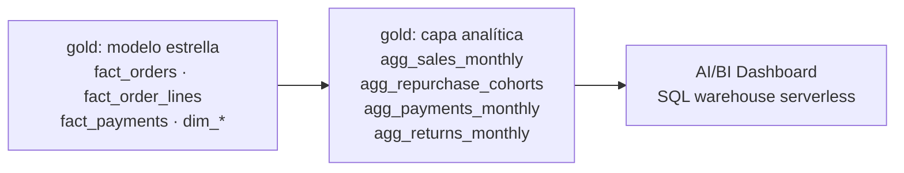

# KPIs y dashboard (nivel 3)

Entregable del nivel 3: una capa analítica agregada sobre el modelo estrella y un dashboard de AI/BI con 4 KPIs. Las decisiones y sus alternativas están en D-18.

## 1. Capa analítica: `gold.agg_*`

Cada KPI tiene **una sola definición**, escrita en código en `src/transform/gold_kpis.py` y calculada por el mismo pipeline que gold. El dashboard solo lee estas tablas, así que dos gráficos nunca pueden calcular "venta neta" de formas distintas.

**Las tablas guardan sumas y conteos, nunca porcentajes.** Las tasas se calculan en la consulta como cociente de sumas (`sum(aprobados) / sum(intentos)`). Promediar porcentajes de países o meses con volúmenes distintos da un resultado incorrecto.

## 2. Definiciones

| KPI | Fórmula | Tabla y grano | Por qué importa |
|---|---|---|---|
| **Ventas netas** | Suma del total cobrado de pedidos *Pagados*, *Enviados* o *Entregados* (sin cancelados, devueltos ni pendientes) | `agg_sales_monthly`: mes × país × canal × segmento | Tamaño y tendencia del negocio; el desglose por canal muestra el avance de la app |
| **Ticket promedio** | Ventas netas / pedidos | `agg_sales_monthly` | Separa crecimiento por más pedidos de crecimiento por pedidos más grandes |
| **Recompra a 90 días** | Personas que vuelven a comprar dentro de 90 días de su primera compra / personas nuevas de la cohorte | `agg_repurchase_cohorts`: mes de la primera compra × país | Retención; es la variable objetivo del modelo de propensión del nivel 4 |
| **Aprobación de pagos** | Pagos aprobados (o luego reembolsados) / (aprobados + rechazados) | `agg_payments_monthly`: mes × canal × método | Cada rechazo es una venta en riesgo; por método muestra dónde está la fricción |
| **Dobles cobros sin devolver** | Cantidad y monto de cobros duplicados que siguen aprobados | `agg_payments_monthly` | Dinero que hay que devolver al cliente; genera tickets urgentes y daño reputacional |
| **Tasa de devolución** | Unidades de pedidos devueltos / unidades vendidas (incluye las devueltas) | `agg_returns_monthly`: mes × categoría | Calidad del catálogo y costo logístico |

### Decisiones de definición que conviene saber explicar

- **El segmento es el de la fecha del pedido**, no el actual: `agg_sales_monthly` toma el segmento de `dim_customer` vigente en ese momento (SCD2). Las ventas de un cliente que hoy es VIP pero compró como *Nuevo* cuentan como *Nuevo*.
- **La recompra se cuenta por persona, no por cuenta:** usa `principal_customer_id`, así las 57 cuentas duplicadas no inflan las cohortes. Es la calidad de datos de silver usada en un KPI.
- **Cohortes incompletas:** si no pasaron 90 días desde el fin del mes de la cohorte, la tasa todavía puede subir. `is_complete` las marca y el dashboard solo muestra las completas.
- **Venta neta usa el total cobrado del pedido**, no la suma de las líneas: incluye los descuentos aplicados en la cabecera (D-14).
- **Las líneas de productos desconocidos** (cuarentena) aparecen en la categoría *Desconocida*; caen fuera de la ventana de 12 meses del dashboard porque son de 2024.

## 3. Dashboard

**Andina Market · KPIs**: AI/BI Dashboard sobre el SQL warehouse serverless, definido en `src/dashboards/andina_kpis.lvdash.json` y desplegado por el bundle (`resources/dashboard.yml`) con el catálogo de cada entorno.

| Zona | Contenido |
|---|---|
| Tarjetas (últimos 12 meses) | Ventas netas · Ticket promedio · Recompra a 90 días · Aprobación de pagos · Dobles cobros sin devolver · Monto por devolver |
| Tendencia | Ventas netas mensuales por canal (web, app, tienda) |
| Comparaciones | Ventas por país · Recompra por cohorte · Aprobación por método de pago · Devolución por categoría |

Valores al 1 de octubre de 2026 (dev, datos sintéticos):

| KPI | Valor |
|---|---|
| Ventas netas, últimos 12 meses | 2.076.200 USD |
| Ticket promedio | 123,21 USD |
| Recompra a 90 días (cohortes completas del último año) | 52,6 % |
| Aprobación de pagos | 90,8 % (tarjeta 88,5 %, efectivo 97,5 %) |
| Dobles cobros sin devolver | 69 cobros, 7.269 USD |
| Tasa de devolución | ~3,3 % en todas las categorías |

**Cómo verlo:** en Databricks, **Dashboards → [dev rhuaman] Andina Market · KPIs (dev)**, o con `databricks bundle summary`, que muestra la URL. Cada lector consulta con sus propios permisos de Unity Catalog (`embed_credentials: false`): necesita `SELECT` sobre `gold`.

**Controles de que el dashboard dice la verdad:** la tarea de validación del job comprueba en cada corrida que las ventas netas, las unidades y los intentos de pago de los agregados cuadren con los hechos (`kpi_vs_hechos.*` en `ops.validation_log`).
