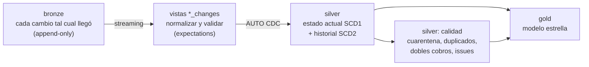
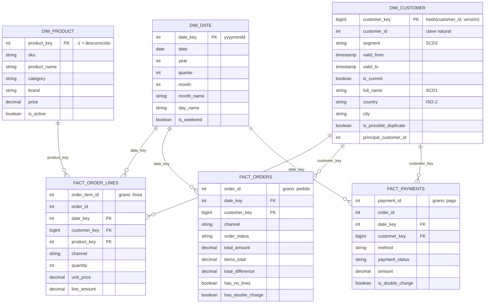

# Modelo de datos: silver y gold (nivel 2)

Entregable del nivel 2: el pipeline de transformación, el diagrama del modelo resultante y por qué las etapas están organizadas así. Las decisiones con sus alternativas descartadas están en D-12 a D-16 del [registro de decisiones](decisiones.md).

## 1. Etapas y responsabilidad de cada una

| Etapa | Responsabilidad | Qué no hace |
|---|---|---|
| **bronze** (nivel 1) | Guardar cada cambio de la fuente, tal cual y con su linaje | No limpia ni deduplica |
| **vistas `*_changes`** | Renombrar a nombres de negocio (`snake_case`), tipar, normalizar (email, país, canal, cuerpo vacío) y validar con expectations | No se publican: son pasos internos del pipeline |
| **silver** | Una fila por entidad con su estado actual (SCD1), más el historial de lo que el negocio necesita ver en el tiempo (SCD2). Es la capa que consumen ML y RAG | No agrega ni mezcla entidades |
| **silver: calidad** | Apartar y explicar lo que no cumple: cuarentena de huérfanos, grupos de duplicados, dobles cobros y el registro único `data_quality_issues` | No corrige datos de negocio por su cuenta |
| **gold** | Modelo estrella para analítica: dimensiones conformadas y hechos con grano explícito | No es fuente para otras transformaciones de silver |

Todo vive en **un solo pipeline de Lakeflow Declarative Pipelines** (`andina_transform`): el motor deduce las dependencias entre tablas, ejecuta en orden, registra las métricas de calidad y vuelve a calcular solo lo necesario. El job `andina_ingesta` lo ejecuta como tercera tarea, después de bronze.

## 2. Modelo estrella (gold)

**Tres hechos con grano distinto** porque responden preguntas distintas: qué productos se venden (línea), cuánto y cómo compra cada cliente (pedido, con el total real que pagó, que no siempre es la suma de las líneas) y cómo se cobra (pago). Mezclarlos en una sola tabla obligaría a repetir el total del pedido en cada línea y sumaría de más.

**Canal y estado** son atributos degenerados en los hechos (pocas categorías, sin atributos propios): una dimensión aparte no aportaría nada.

## 3. Silver: tablas y cambios en el tiempo

| Tabla | Tipo | Clave | Contenido |
|---|---|---|---|
| `silver.customers` | SCD1 (AUTO CDC) | `customer_id` | Estado actual; `email_norm`, `email_valido`, `country_iso`, ciudad "Desconocida" si falta |
| `silver.customer_segment_history` | SCD2 (AUTO CDC) | `customer_id` + vigencia | Una fila por cada segmento que tuvo el cliente |
| `silver.products` | SCD1 | `product_id` | Catálogo, con `is_active` |
| `silver.orders` | SCD1 | `order_id` | `order_date` corregida si el año venía mal digitado; `order_date_raw` conserva el original |
| `silver.order_items` | SCD1 | `order_item_id` | Sin cantidades 0; `line_amount` calculado |
| `silver.payments` | SCD1 | `payment_id` | Estado actual del pago |
| `silver.payment_status_history` | SCD2 | `payment_id` + vigencia | Recorrido de estados: Pendiente → Aprobado / Rechazado → Reembolsado |
| `silver.support_tickets` | SCD1 | `ticket_id` | Cuerpo vacío normalizado a NULL; spam borrado en la fuente se elimina |
| `silver.customer_duplicate_groups`, `silver.customer_duplicates` | Vista materializada | — | Cuentas que parecen la misma persona |
| `silver.quarantine_order_items` | Vista materializada | — | Líneas con producto inexistente |
| `silver.payment_double_charges` | Vista materializada | — | Pagos aprobados duplicados |
| `silver.data_quality_issues` | Vista materializada | — | Una fila por problema: regla, acción, entidad, id y detalle |

**Cómo se manejan los cambios en el tiempo** (lo que pide el reto con los ejemplos del segmento y del pago):

- **Estado actual (SCD1):** AUTO CDC aplica cada cambio de bronze sobre la fila de su clave, ordenando por `_ct_version` (el orden exacto de la fuente, no el reloj de la aplicación) y borrando cuando llega un DELETE.
- **Historial (SCD2):** otra tabla recibe los mismos cambios, pero abre una versión nueva solo cuando cambia la columna que importa (`segment` o `status`). Los demás cambios del cliente no generan versiones.
- **Vigencia:** `__START_AT` y `__END_AT` guardan la versión de Change Tracking (para ordenar) y `updated_at` (la fecha de negocio). En `gold.dim_customer` se convierten en `valid_from` y `valid_to`.
- **Point-in-time en los hechos:** cada pedido se une con la versión del cliente vigente en la fecha del pedido. Una venta de marzo queda con el segmento que el cliente tenía en marzo, aunque hoy sea VIP.

Ejemplo real del pipeline: el cliente 5115 fue *Nuevo* desde su alta hasta el 29/09/2026 a las 23:55 y *Regular* desde entonces; el pago 29596 estuvo *Pendiente* 7 horas y 30 minutos antes de pasar a *Aprobado*.

## 4. Formato, particionamiento y organización

- **Formato:** Delta en todas las capas (transacciones, historial, `MERGE` para AUTO CDC).
- **Sin particionamiento por directorios.** Las tablas tienen de cientos a decenas de miles de filas; particionar crearía miles de archivos pequeños y haría todo más lento. Databricks recomienda no particionar tablas de menos de 1 TB.
- **Liquid clustering** en su lugar: silver por su clave (las actualizaciones de AUTO CDC buscan por clave) y los hechos por `date_key` (casi toda consulta analítica filtra por fecha). A diferencia de las particiones, las claves de clustering se pueden cambiar sin reescribir la tabla si cambian los patrones de consulta.
- **Nombres:** silver y gold en `snake_case` y en inglés técnico; bronze conserva los nombres de la fuente para no alterar lo recibido.
