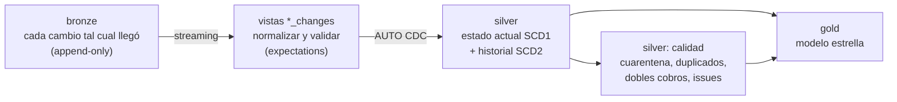
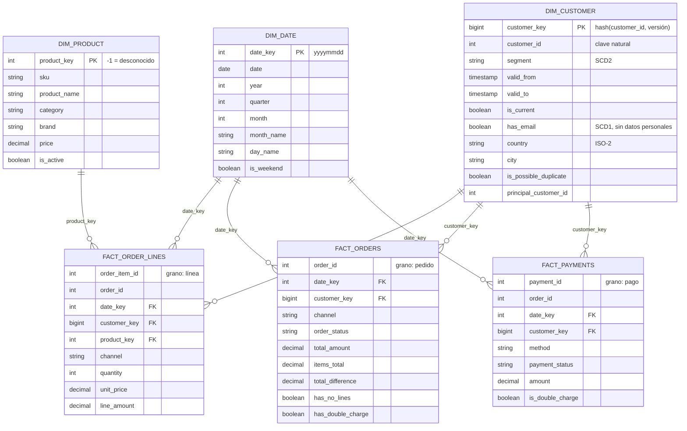

# Modelo de datos: silver y gold (nivel 2)

Entregable del nivel 2: el pipeline de transformación, el diagrama del modelo resultante y por qué las etapas están organizadas así. Las decisiones con sus alternativas descartadas están en D-12 a D-16 del [registro de decisiones](decisiones.md).

## 1. Etapas y responsabilidad de cada una

| Etapa | Responsabilidad | Qué no hace |
|---|---|---|
| **bronze** (nivel 1) | Guardar cada cambio de la fuente, tal cual y con su linaje | No limpia ni deduplica |
| **vistas `*_changes`** | Renombrar a nombres de negocio (`snake_case`), tipar, normalizar (email, país, canal, cuerpo vacío) y validar con expectations | No se publican: son pasos internos del pipeline |
| **silver** | Una fila por entidad con su estado actual (SCD1), más el historial de lo que el negocio necesita ver en el tiempo (SCD2). Es la capa que consumen ML y RAG | No agrega ni mezcla entidades |
| **silver: calidad** | Apartar y explicar lo que no cumple: cuarentena de huérfanos, grupos de duplicados, dobles cobros y el registro único `data_quality_issues` | No corrige datos de negocio por su cuenta |
| **gold** | Modelo estrella para analítica: dimensiones conformadas y hechos con grano explícito | No es fuente para otras transformaciones de silver |

Todo vive en **un solo pipeline de Lakeflow Declarative Pipelines** (`andina_transform`): el motor deduce las dependencias entre tablas, ejecuta en orden, registra las métricas de calidad y vuelve a calcular solo lo necesario. El job `andina_ingesta` lo ejecuta como tercera tarea, después de bronze.

### Por qué las etapas están organizadas así

Cada etapa existe porque resuelve un problema que la anterior no puede resolver, y el orden sale de qué necesita ver cada una.

1. **Bronze separado de silver: separar "qué llegó" de "qué es verdad".** Bronze guarda cada cambio sin interpretar y es append-only, así que es la historia completa de la fuente. Si mañana cambia una regla de limpieza, silver y gold se recalculan desde bronze (*full refresh* del pipeline) sin volver a consultar el OLTP ni perder nada. Si la limpieza ocurriera al ingerir, un error de regla quedaría grabado para siempre.

2. **Validar antes de aplicar el cambio, no después.** Las vistas `*_changes` normalizan y aplican las expectations a **cada cambio individual**, con su operación (`I`, `U`, `D`), antes de que AUTO CDC lo aplique sobre el estado actual. Si se validara después, un cambio inválido ya habría pisado la fila buena; por ejemplo, una línea que pasa a cantidad 0 habría reemplazado la cantidad anterior. Son vistas temporales (no se publican), así que no duplican almacenamiento ni crean una tabla intermedia que nadie consume.

3. **Silver por entidad, sin mezclar entidades.** Una tabla por entidad, con su clave, su estado actual (SCD1) y, donde importa, su historial (SCD2). Es la capa reutilizable: ML, RAG y el agente leen silver y cada uno arma los cruces que necesita. Si silver ya mezclara entidades para un caso de uso, los demás heredarían ese diseño.

4. **La calidad entre entidades va después de silver, como etapa propia.** Las reglas de una sola fila (email, país, PK nula) se evalúan en el paso 2. Pero las que cruzan entidades, como líneas con producto inexistente, total del pedido distinto a la suma de sus líneas, pedidos sin líneas, clientes duplicados o dobles cobros, necesitan ver **varias tablas en su estado actual**, y eso no existe hasta que silver está consolidado. Por eso son vistas materializadas que leen silver. Además **marcan, no modifican**: silver sigue diciendo lo que dice la fuente, y la explicación vive en `data_quality_issues` y en las tablas de cuarentena.

5. **Gold solo lee silver, nunca bronze.** La limpieza se define una sola vez, en silver. Si gold leyera bronze, cada hecho repetiría las reglas y tarde o temprano dos tablas limpiarían distinto. Gold se dedica a una sola cosa: dar forma de estrella al consumo analítico (claves sustitutas, grano explícito y join point-in-time con la versión del cliente).

6. **Streaming hasta silver, vistas materializadas después.** Bronze crece en cada lote y solo agrega filas, así que silver lo procesa de forma incremental (solo lo nuevo) con streaming y AUTO CDC. La calidad entre entidades y gold, en cambio, necesitan el estado completo (cruces, agregados y vigencias), así que son vistas materializadas: el motor las recalcula, de forma incremental cuando puede, y el resultado es siempre el mismo para los mismos datos (idempotente).

7. **Todo en un solo pipeline, ejecutado justo después de bronze.** El motor deduce el orden desde las dependencias, refresca gold solo si silver cambió y registra las métricas de calidad en un único event log. Al correr como tarea del mismo job, gold siempre refleja el mismo lote que acaba de llegar a bronze, y la tarea siguiente (`validar_lakehouse`) comprueba que cuadre.

**Alternativas de organización descartadas:**

| Alternativa | Por qué no |
|---|---|
| Menos etapas: de bronze directo a un gold que limpia y modela a la vez | Mezcla dos responsabilidades. Cada hecho repetiría las reglas de limpieza, y ML y RAG no tendrían una capa limpia por entidad para consumir |
| Más etapas: publicar una silver "cruda tipada" y otra "limpia" | Duplica almacenamiento y tablas sin que nadie consuma la intermedia. Las vistas temporales `*_changes` cumplen ese papel sin publicarse |
| Validar después de AUTO CDC | Un cambio inválido ya habría reemplazado el estado bueno (el caso de la cantidad 0) |
| La calidad entre entidades dentro de las vistas de silver | Las reglas que cruzan tablas no se pueden evaluar fila a fila sobre un stream; necesitan el estado consolidado |
| Un pipeline para silver y otro para gold | Se pierde el grafo completo: habría que orquestar a mano cuándo refrescar gold. Se separarían solo si tuvieran dueños o frecuencias distintas (D-12) |

## 2. Modelo estrella (gold)

También exportado como imagen: [diagramas/modelo_estrella.png](diagramas/modelo_estrella.png).

**Tres hechos con grano distinto** porque responden preguntas distintas: qué productos se venden (línea), cuánto y cómo compra cada cliente (pedido, con el total real que pagó, que no siempre es la suma de las líneas) y cómo se cobra (pago). Mezclarlos en una sola tabla obligaría a repetir el total del pedido en cada línea y sumaría de más.

**Canal y estado** son atributos degenerados en los hechos (pocas categorías, sin atributos propios): una dimensión aparte no aportaría nada.

## 3. Silver: tablas y cambios en el tiempo

| Tabla | Tipo | Clave | Contenido |
|---|---|---|---|
| `silver.customers` | SCD1 (AUTO CDC) | `customer_id` | Estado actual; `email_norm`, `email_valido`, `country_iso`, ciudad "Desconocida" si falta |
| `silver.customer_segment_history` | SCD2 (AUTO CDC) | `customer_id` + vigencia | Una fila por cada segmento que tuvo el cliente |
| `silver.products` | SCD1 | `product_id` | Catálogo, con `is_active` |
| `silver.orders` | SCD1 | `order_id` | `order_date` corregida si el año venía mal digitado; `order_date_raw` conserva el original |
| `silver.order_items` | SCD1 | `order_item_id` | Sin cantidades ≤ 0 (se aplican como borrado); `line_amount` calculado |
| `silver.rejected_order_items` | Append-only | — | Cada cambio de línea que llegó con cantidad ≤ 0 |
| `silver.payments` | SCD1 | `payment_id` | Estado actual del pago |
| `silver.payment_status_history` | SCD2 | `payment_id` + vigencia | Recorrido de estados: Pendiente → Aprobado / Rechazado → Reembolsado |
| `silver.support_tickets` | SCD1 | `ticket_id` | Cuerpo vacío normalizado a NULL; spam borrado en la fuente se elimina |
| `silver.customer_duplicate_groups`, `silver.customer_duplicates` | Vista materializada | — | Cuentas que parecen la misma persona |
| `silver.quarantine_order_items` | Vista materializada | — | Líneas con producto inexistente |
| `silver.payment_double_charges` | Vista materializada | — | Pagos aprobados duplicados, aunque ya se hayan devuelto |
| `silver.unmapped_source_columns` | Vista materializada | — | Columnas de bronze que silver no lleva (cambios de esquema pendientes) |
| `silver.data_quality_issues` | Vista materializada | — | Una fila por problema: regla, acción, entidad, id y detalle, sin datos personales |

El detalle de cada regla de limpieza, validación y cuarentena está en [reglas_calidad.md](reglas_calidad.md).

**Cómo se manejan los cambios en el tiempo** (lo que pide el reto con los ejemplos del segmento y del pago):

- **Estado actual (SCD1):** AUTO CDC aplica cada cambio de bronze sobre la fila de su clave, ordenando por `_ct_version` (el orden exacto de la fuente, no el reloj de la aplicación) y borrando cuando llega un DELETE.
- **Historial (SCD2):** otra tabla recibe los mismos cambios, pero abre una versión nueva solo cuando cambia la columna que importa (`segment` o `status`). Los demás cambios del cliente no generan versiones.
- **Vigencia:** `__START_AT` y `__END_AT` guardan la versión de Change Tracking (para ordenar) y `updated_at` (la fecha de negocio). En `gold.dim_customer` se convierten en `valid_from` y `valid_to`.
- **Point-in-time en los hechos:** cada pedido se une con la versión del cliente vigente en la fecha del pedido. Una venta de marzo queda con el segmento que el cliente tenía en marzo, aunque hoy sea VIP.

Ejemplo real del pipeline: el cliente 5115 fue *Nuevo* desde su alta hasta el 29/09/2026 a las 23:55 y *Regular* desde entonces; el pago 29596 estuvo *Pendiente* 7 horas y 30 minutos antes de pasar a *Aprobado*.

## 4. Formato, particionamiento y organización

- **Formato:** Delta en todas las capas (transacciones, historial, `MERGE` para AUTO CDC).
- **Sin particionamiento por directorios.** Las tablas tienen de cientos a decenas de miles de filas; particionar crearía miles de archivos pequeños y haría todo más lento. Databricks recomienda no particionar tablas de menos de 1 TB.
- **Liquid clustering** en su lugar: silver por su clave (las actualizaciones de AUTO CDC buscan por clave) y los hechos por `date_key` (casi toda consulta analítica filtra por fecha). A diferencia de las particiones, las claves de clustering se pueden cambiar sin reescribir la tabla si cambian los patrones de consulta.
- **Nombres:** silver y gold en `snake_case` y en inglés técnico; bronze conserva los nombres de la fuente para no alterar lo recibido.
