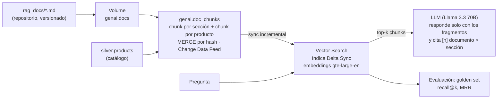

# Capa RAG (nivel 5)

Preguntas en lenguaje natural sobre políticas, preguntas frecuentes, manuales y catálogo de Andina Market, respondidas con fragmentos recuperados y citados. Decisiones y alternativas: D-22 a D-24.

## 1. Ciclo de vida: del documento a la respuesta

Todo corre en el job `andina_rag` (serverless, con el service principal del entorno): **ingesta e indexación → evaluación**. Código en `src/rag/`.

## 2. Documentos

| Documento | Contenido |
|---|---|
| `politica_devoluciones` | Plazo de 30 días, productos que no se devuelven, cambios de talla, reembolsos por método de pago |
| `politica_envios` | Ciudades, plazos por destino, costo, seguimiento, pedido retrasado o "entregado" sin recibir |
| `faq_pagos` | Métodos por canal, rechazos, transferencias pendientes, doble cobro, cargos no reconocidos |
| `faq_cuenta_seguridad` | Acceso, correo, app, fraude en la cuenta, protección de datos |
| `programa_clientes` | Niveles Nuevo / Regular / Frecuente / VIP (mismas reglas que el CRM), beneficios, cupones |
| `garantias` | Cobertura, plazos por categoría, cómo reclamar, productos dañados o que se recalientan |
| `atencion_cliente` | Canales, horarios, prioridades y tiempos de respuesta |
| `manual_electronica`, `manual_hogar`, `guia_moda_deportes`, `guia_belleza_mascotas` | Uso, cuidado y problemas frecuentes por categoría |
| Catálogo (`silver.products`) | Un chunk por producto: nombre, SKU, categoría, marca, precio, estado y descripción |

Los documentos se generaron con IA a partir de los datos de la base, para que sean coherentes: mismos métodos de pago por canal, mismas reglas de segmento, mismos tipos de ticket y prioridades, mismas categorías y marcas.

## 3. Cómo se mantiene actualizado

- **Cambia un documento:** se edita en `rag_docs/`, se despliega con el bundle y el job lo publica en el Volume. El `MERGE` por hash actualiza solo los chunks cuyo texto cambió y borra los de secciones eliminadas; el índice *triggered* sincroniza solo esos cambios.
- **Cambia el catálogo** (precio, producto descontinuado): llega por la ingesta a silver, y el job diario actualiza los chunks de productos.
- **Se borra un documento:** se borra del Volume, sus chunks de la tabla y, al sincronizar, del índice.

## 4. Gobierno con Unity Catalog

| Objeto | Gobierno |
|---|---|
| Volume `genai.docs` | Permisos de lectura y escritura como cualquier objeto de UC |
| Tabla `genai.doc_chunks` | Linaje hacia el Volume y hacia `silver.products`; cada chunk guarda su `source` |
| Índice `genai.doc_chunks_index` | Objeto de UC: se consulta con permisos de `SELECT` |
| Respuestas | Citan `[n] documento > sección`: se sabe qué documento originó cada afirmación |

El índice no contiene datos personales: solo políticas, manuales y catálogo. Los datos de clientes los consultaría un agente (nivel 6) con herramientas controladas, no el índice.

## 5. Evaluación del retrieval

Golden set de 30 preguntas redactadas como las haría un cliente (`src/rag/golden_set.json`), cada una con la sección o el producto que la responde. **recall@k** = proporción de preguntas con un chunk relevante entre los k primeros; **MRR** = qué tan arriba aparece el primero relevante.

| Corrida | Modo | recall@1 | recall@3 | recall@5 | MRR |
|---|---|---|---|---|---|
| Embeddings multilingües `qwen3-embedding-0-6b` (primera corrida) | ANN | 0,933 | 1,000 | **1,000** | 0,967 |
| | Híbrido | 0,800 | 0,900 | 0,933 | 0,847 |
| `gte-large-en`, chunking inicial | ANN | 0,633 | 0,833 | 0,833 | 0,728 |
| | Híbrido | 0,667 | 0,767 | 0,867 | 0,740 |
| `gte-large-en` + tablas linealizadas + vocabulario del cliente | ANN | 0,633 | 0,867 | 0,900 | 0,757 |
| | **Híbrido (en uso)** | 0,667 | 0,833 | **0,933** | **0,769** |

**Cómo leerlo:**

- **El modelo multilingüe era claramente mejor** con preguntas en español (recall@5 de 1,0). Respondió en la primera corrida y después su endpoint dejó de estar disponible en el workspace ("does not exist"): no se puede depender de él. Se usa `gte-large-en` y queda como mejora inmediata cuando qwen3 (u otro modelo multilingüe) esté disponible de forma estable.
- **La evaluación guió dos mejoras generales**, no ajustes al golden set: convertir cada fila de las tablas en una frase (los embeddings representaban mal las filas con `|`) y usar el vocabulario del cliente ("batería portátil", no solo "power bank"). recall@5 subió de 0,867 a 0,933.
- **La búsqueda híbrida gana** con `gte-large-en`: las palabras exactas compensan parte de lo que el modelo en inglés no entiende del español.

**Fallas que quedan** (`genai.retrieval_eval`):

| Tipo | Ejemplo | Causa |
|---|---|---|
| Sinónimos en español | "dos cargos iguales" frente a "me cobraron dos veces"; "ventajas" frente a "beneficios" | Modelo de embeddings en inglés |
| Variantes casi idénticas de un producto | Shampoo de 300 ml frente a 500 ml; polo talla M frente a XL | Los chunks de las variantes son casi iguales; el vecino también responde la pregunta |
| Pregunta de política que trae productos | "Cambiar un polo por una talla más grande" trae fichas de polos | La búsqueda híbrida premia la palabra "polo"; se resolvería filtrando por tipo de documento según la intención |

El umbral de calidad del job (recall@5 ≥ 0,80) se cumple; si un cambio de documentos o de chunking lo baja, el job falla.

## 6. Consultas de ejemplo (recuperado y respuesta)

Búsqueda híbrida, top 4, respuesta de `databricks-meta-llama-3-3-70b-instruct` con la instrucción de usar solo los fragmentos y citarlos. Guardadas en `genai.rag_examples`.

**1. "Me cobraron dos veces mi pedido hace una semana y no me devuelven, ¿qué hago?"**
Recuperado: [1] faq_pagos > Me cobraron dos veces el mismo pedido · [2] faq_pagos > Si mi pago fue rechazado… · [3] politica_envios > Pedido retrasado · [4] politica_envios > Plazos de entrega
> Debes abrir un caso por chat o por la app indicando el número de pedido, ya que han pasado más de 72 horas y el cargo duplicado sigue en tu cuenta, para que se atienda con prioridad urgente. El reembolso del duplicado seguirá los plazos de tu método de pago. [1]

**2. "¿Puedo devolver un perfume que ya abrí?"**
Recuperado: [1] politica_devoluciones > Productos que no se pueden devolver · [2] guia_belleza_mascotas > Belleza: productos cosméticos · [3] guia_belleza_mascotas > Compras por volumen · [4] politica_devoluciones > Cómo iniciar una devolución
> No, no puedes devolver un perfume que ya abriste, ya que los productos de belleza abiertos o con el sello de seguridad roto no se pueden devolver por razones de higiene y seguridad. Sin embargo, si el perfume llegó dañado o defectuoso, puedes pedir el cambio o el reembolso si reportas el problema dentro de las 48 horas desde la entrega. [1, 2]

**3. "¿Cuánto demora el envío a Arequipa y cuánto cuesta si compro 45 dólares?"** (respuesta con un error)
Recuperado: [1] politica_envios > Costo de envío · [2] politica_envios > Plazos de entrega · [3] politica_devoluciones > Introducción · [4] politica_envios > Países y ciudades con despacho
> Según la política de envíos y entregas, Arequipa es considerada una ciudad principal en Perú, por lo que el plazo estimado de entrega es de 2 a 5 días hábiles. El costo de envío para pedidos menores a 60 USD en ciudades principales es de 4,90 USD. [1, 2, 4]

El plazo es correcto, **el costo no**: el fragmento [1] dice "4,90 USD en capitales y 7,90 USD en el resto del país", y Arequipa no es capital. El retrieval fue correcto (la sección exacta en primer lugar) y el modelo la leyó mal. Es la razón por la que medir el retrieval no basta: hay que evaluar también la **fidelidad de la respuesta al fragmento** (sección 7).

**4. "¿Qué necesito para ser VIP y qué beneficios tiene?"**
Recuperado: [1] programa_clientes > Niveles del programa · [2] programa_clientes > Beneficios por nivel · [3] guia_belleza_mascotas > Compras por volumen · [4] programa_clientes > Cupones de descuento
> Para ser VIP, necesitas haber realizado 12 o más compras, o tener un total de 1.500 USD o más en compras, en los últimos 365 días. Los beneficios de ser VIP incluyen envío gratis siempre, línea de atención preferente, cambios y devoluciones con recojo a domicilio gratis en todo el país y 15 % de descuento en el mes de cumpleaños. [1, 2]

**5. "¿La arrocera Mistura de 2.8 L tiene garantía y cuánto cuesta?"**
Recuperado: [1] producto:HOG-00001 > Olla arrocera Mistura 2.8 L · [2] garantias > Qué cubre la garantía · [3] producto:HOG-00063 > Olla arrocera Mistura 1.8 L · [4] producto:HOG-00029 > Olla arrocera Mistura 1 L
> La olla arrocera Mistura de 2.8 L tiene una garantía de 24 meses y cuesta 63.90 USD. [1]

## 7. Límites conocidos y siguientes pasos

- **Fidelidad de la respuesta:** el ejemplo 3 muestra que el modelo puede leer mal un fragmento correcto. Siguiente paso: evaluar las respuestas con un juez automático (criterios de fidelidad y relevancia) sobre el golden set, y en el agente (nivel 6) usar herramientas deterministas para los cálculos, como el costo de envío según la ciudad, en lugar de dejar que el modelo los deduzca del texto.
- **Embeddings multilingües:** volver a `qwen3-embedding` (u otro multilingüe) cuando esté disponible de forma estable; la primera corrida mostró recall@5 de 1,0.
- **Modelos de generación:** los endpoints de Claude figuran en el workspace con cuota 0; se usa Llama 3.3 70B.
- **Costo:** el endpoint de Vector Search se cobra por hora mientras exista. Conviene borrarlo cuando no se usa; el job lo recrea.
